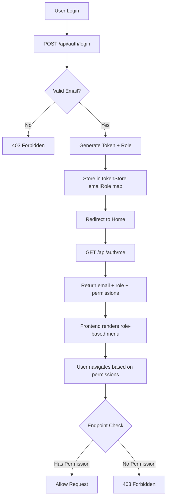

# Role Model Expansion — Technical Design

## Architecture Overview

The role model expansion extends StaffTrack's permission system with two new personas (SA/Pre-Sales, Sales). The system maintains backward compatibility with the existing 4-role model while introducing new access control rules.

### System Layers

```
┌─────────────────────────────────────────────┐
│        Frontend Menu/Navigation              │  Role-based routing & page visibility
├─────────────────────────────────────────────┤
│      Auth Layer (Token Validation)           │  In-memory role validation
├─────────────────────────────────────────────┤
│   Backend API Endpoints (RBAC Middleware)    │  Role-based endpoint filtering
├─────────────────────────────────────────────┤
│     Database Layer (Role Enum)               │  user_roles.role column
└─────────────────────────────────────────────┘
```

---

## Data Model Changes

### Database Schema

#### 1. Update `user_roles` Table
```sql
-- Existing: role TEXT
-- New: role ENUM-like text with constraint
ALTER TABLE user_roles ADD COLUMN role_updated TEXT;
-- Backfill data: 'admin' → 'admin', 'hr' → 'hr', 'coordinator' → 'coordinator', 'staff' → 'staff'
UPDATE user_roles SET role_updated = role;
-- Drop old, rename new
ALTER TABLE user_roles DROP COLUMN role;
ALTER TABLE user_roles RENAME COLUMN role_updated TO role;

-- Add constraint (SQLite approach):
-- Enforce via CHECK constraint in migrations or application layer validation
CREATE TABLE user_roles_new (
  id INTEGER PRIMARY KEY AUTOINCREMENT,
  email TEXT NOT NULL UNIQUE,
  role TEXT NOT NULL CHECK(role IN ('admin', 'hr', 'coordinator', 'sa_presales', 'sales', 'staff')),
  created_at DATETIME DEFAULT CURRENT_TIMESTAMP,
  updated_at DATETIME DEFAULT CURRENT_TIMESTAMP
);
INSERT INTO user_roles_new (email, role) SELECT email, role FROM user_roles;
DROP TABLE user_roles;
ALTER TABLE user_roles_new RENAME TO user_roles;
```

#### 2. Add Role Audit Log (Optional)
```sql
CREATE TABLE role_audit_log (
  id INTEGER PRIMARY KEY AUTOINCREMENT,
  user_email TEXT NOT NULL,
  old_role TEXT,
  new_role TEXT NOT NULL,
  changed_by TEXT NOT NULL, -- Admin email
  changed_at DATETIME DEFAULT CURRENT_TIMESTAMP
);
```

---

## API Design

### Endpoint: User Role Management

**POST /api/admin/user-roles**
```json
{
  "email": "john.smith@company.com",
  "role": "sa_presales"
}
```

**Response (200 OK):**
```json
{
  "email": "john.smith@company.com",
  "role": "sa_presales",
  "updated_at": "2026-04-04T10:30:00Z"
}
```

**Error (403 Forbidden):**
```json
{
  "error": "Only admins can assign roles"
}
```

### Endpoint: Get Current User Role

**GET /api/auth/me**
```json
{
  "email": "john.smith@company.com",
  "role": "sa_presales",
  "permissions": ["skill_search", "view_staff", "generate_cv", "export_cv", "view_orgchart"]
}
```

---

## Backend Implementation Details

### File: `backend/src/middleware/authMiddleware.js`

Add role-aware middleware:

```javascript
function requireRole(...allowedRoles) {
  return (req, res, next) => {
    const user = req.session.user; // Already contains { email, role }
    
    if (!allowedRoles.includes(user.role)) {
      return res.status(403).json({ 
        error: `Access denied. Required role: ${allowedRoles.join(' or ')}` 
      });
    }
    next();
  };
}

module.exports = { requireRole };
```

### File: `backend/src/utils/rolePermissions.js`

Define role-permission matrix:

```javascript
const ROLE_PERMISSIONS = {
  admin: [
    'view_staff', 'view_submissions', 'view_projects', 'view_cv',
    'edit_projects', 'edit_submissions', 'export_cv', 'export_reports',
    'manage_users', 'manage_catalog', 'skill_consolidation'
  ],
  hr: [
    'view_staff', 'view_submissions', 'view_cv', 'export_cv',
    'export_reports', 'view_projects', 'skill_consolidation'
  ],
  coordinator: [
    'view_staff', 'view_submissions', 'view_projects', 'view_cv',
    'edit_projects', 'view_orgchart'
  ],
  sa_presales: [
    'view_staff', 'view_cv', 'export_cv', 'skill_search',
    'view_orgchart'
  ],
  sales: [
    'view_staff', 'view_cv', 'export_cv', 'skill_search',
    'view_orgchart'
  ],
  staff: [
    'view_own_submission', 'edit_own_submission', 'view_own_cv',
    'edit_own_cv', 'view_orgchart'
  ]
};

function hasPermission(role, permission) {
  return ROLE_PERMISSIONS[role]?.includes(permission) ?? false;
}

module.exports = { ROLE_PERMISSIONS, hasPermission };
```

### Routes with RBAC

**File: `backend/src/routes/admin.js`**
```javascript
router.post('/user-roles', 
  requireRole('admin'),
  validateEmail,
  assignUserRole
);

async function assignUserRole(req, res) {
  const { email, role } = req.body;
  const validRoles = ['admin', 'hr', 'coordinator', 'sa_presales', 'sales', 'staff'];
  
  if (!validRoles.includes(role)) {
    return res.status(400).json({ error: 'Invalid role' });
  }
  
  db.prepare(`UPDATE user_roles SET role = ? WHERE email = ?`)
    .run(role, email);
  
  // Invalidate in-memory token (user must re-login)
  delete tokenStore[email];
  
  res.json({ email, role, updated_at: new Date().toISOString() });
}
```

---

## Frontend Implementation Details

### File: `public/menu.js`

Update menu generation based on role:

```javascript
const MENU_BY_ROLE = {
  admin: [
    { label: 'Admin Dashboard', href: 'admin.html' },
    { label: 'Staff View', href: 'staff-view.html' },
    { label: 'My Submission', href: 'submission.html' },
    { label: 'Catalog', href: 'catalog.html' },
    { label: 'CV Profile', href: 'cv-profile.html' },
    { label: 'Projects', href: 'projects.html' },
    { label: 'Org Chart', href: 'orgchart.html' }
  ],
  hr: [
    { label: 'Staff View', href: 'staff-view.html' },
    { label: 'My Submission', href: 'submission.html' },
    { label: 'CV Profile', href: 'cv-profile.html' },
    { label: 'Org Chart', href: 'orgchart.html' }
  ],
  coordinator: [
    { label: 'Staff View', href: 'staff-view.html' },
    { label: 'My Submission', href: 'submission.html' },
    { label: 'CV Profile', href: 'cv-profile.html' },
    { label: 'Projects', href: 'projects.html' },
    { label: 'Org Chart', href: 'orgchart.html' }
  ],
  sa_presales: [
    { label: 'Skill Search', href: 'skill-search.html' },
    { label: 'My Submission', href: 'submission.html' },
    { label: 'CV Profile', href: 'cv-profile.html' },
    { label: 'Org Chart', href: 'orgchart.html' }
  ],
  sales: [
    { label: 'Skill Search', href: 'skill-search.html' },
    { label: 'My Submission', href: 'submission.html' },
    { label: 'CV Profile', href: 'cv-profile.html' },
    { label: 'Org Chart', href: 'orgchart.html' }
  ],
  staff: [
    { label: 'My Submission', href: 'submission.html' },
    { label: 'CV Profile', href: 'cv-profile.html' },
    { label: 'Org Chart', href: 'orgchart.html' }
  ]
};

function buildMenuForRole(role) {
  const userRole = localStorage.getItem('userRole') || role;
  return MENU_BY_ROLE[userRole] || [];
}
```

### File: `public/index.html`

Add role display to header:

```html
<header>
  <h1>StaffTrack</h1>
  <div id="userInfo">
    <span id="userEmail"></span>
    <span id="userRole" class="role-badge"></span>
    <button onclick="logout()">Logout</button>
  </div>
</header>
```

### File: `public/app.js`

Update auth flow:

```javascript
async function initializeApp() {
  const response = await fetch('/api/auth/me');
  if (!response.ok) {
    window.location.href = 'login.html';
    return;
  }
  
  const user = await response.json();
  document.getElementById('userEmail').textContent = user.email;
  document.getElementById('userRole').textContent = formatRoleLabel(user.role);
  localStorage.setItem('userRole', user.role);
  
  buildMenuForRole(user.role);
}

function formatRoleLabel(role) {
  const labels = {
    'admin': 'Administrator',
    'hr': 'HR',
    'coordinator': 'Coordinator',
    'sa_presales': 'Solution Architect',
    'sales': 'Sales / BD',
    'staff': 'Staff'
  };
  return labels[role] || role;
}
```

---

## Async Data Flow



---

## Security Considerations

1. **Server-Side Validation**: All role checks must occur server-side; never trust client role claims
2. **Token Invalidation**: When role changes, invalidate existing tokens to force re-login
3. **API Endpoint Guards**: Every endpoint must validate role via middleware
4. **SQL Injection Prevention**: Use parameterized queries for all role updates
5. **Audit Logging**: Log all admin role assignments to `role_audit_log` table

---

## Testing Strategy

### Unit Tests
- Role permission matrix coverage (admin, hr, coordinator, sa_presales, sales, staff)
- Role validation on POST /api/admin/user-roles
- Permission check utility functions

### Integration Tests
- API endpoints respect RBAC (valid and invalid role access)
- Token invalidation on role change
- Menu generation matches assigned role

### E2E Tests
- User with sa_presales role can access skill-search but not admin
- User with sales role can view org-chart and generate CVs
- Admin can assign roles and see role audit log

---

## Deployment Notes

1. **Migration Order**: Update schema, seed new role values, deploy backend, deploy frontend
2. **Rollback Plan**: Keep old role column temporarily; revert if issues arise
3. **Existing Users**: Default to 'staff' role; admin must explicitly promote as needed
4. **Token Expiry**: No change; existing tokens remain valid until role is reassigned
