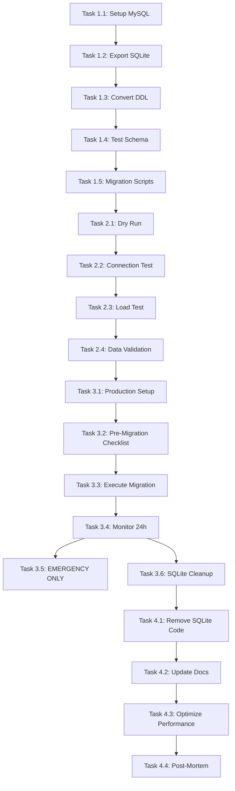

# SQLite to MySQL Migration - Tasks

## Phase 1: Preparation (No Production Impact)

### Task 1.1: Create MySQL Database & User
**Objective:** Set up MySQL environment  
**Status:** Not Started  
**Assigned To:** DevOps  
**Time Estimate:** 30 min  

**Steps:**
1. Provision MySQL 8.0+ server (RDS, Docker, or local)
2. Create database: `stafftrack`
3. Create user: `stafftrack_user` with all privileges on `stafftrack`
4. Test connection with MySQL client
5. Verify charset is `utf8mb4`

**Verification:**
```sql
SHOW DATABASES LIKE 'stafftrack';
SELECT USER FROM mysql.user WHERE USER='stafftrack_user';
SHOW CREATE DATABASE stafftrack;
```

**Rollback:** `DROP DATABASE stafftrack; DROP USER 'stafftrack_user'@'%';`

---

### Task 1.2: Export SQLite Data & Schema
**Objective:** Create backup for migration  
**Status:** Not Started  
**Assigned To:** Backend Dev  
**Time Estimate:** 1 hour  

**Steps:**
1. Create export script: `scripts/export-sqlite.js`
2. Run against live SQLite database at `/data/submissions.db`
3. Generate outputs:
   - `exports/schema.sql` (CREATE TABLE statements)
   - `exports/data.json` (all tables and rows)
   - `exports/row_counts_before.json` (baseline for verification)
4. Verify all tables exported (12 tables)
5. Commit export files to `exports/` folder (do NOT commit to git for security)

**Validation:**
```bash
# Check export files exist
ls -lh exports/
# Verify JSON is valid
node -e "JSON.parse(require('fs').readFileSync('exports/data.json'))"
# Count rows in JSON
node -e "console.log(Object.entries(JSON.parse(require('fs').readFileSync('exports/data.json'))).map(([k,v]) => k + ': ' + v.length))"
```

**Rollback:** Delete export files (no database changes yet)

---

### Task 1.3: Convert SQLite DDL to MySQL DDL
**Objective:** Create MySQL-compatible schema  
**Status:** Not Started  
**Assigned To:** Backend Dev  
**Time Estimate:** 2 hours  

**Steps:**
1. Create conversion script: `scripts/convert-ddl.js`
2. Read `exports/schema.sql` (SQLite DDL)
3. Apply conversions:
   - TEXT → VARCHAR(255) or LONGTEXT (based on content)
   - INTEGER → INT or BIGINT
   - Add AUTO_INCREMENT for ID fields
   - Add ENGINE=InnoDB
   - Add CHARSET=utf8mb4 COLLATE=utf8mb4_unicode_ci
   - Convert PRAGMA statements to MySQL syntax
4. Generate: `exports/schema_mysql.sql`
5. Manually review and test schema creation (see Task 1.4)

**Template conversions:** Use mappings from Design doc

**Validation:**
```bash
# Validate SQL syntax (mysql client will catch errors)
mysql -u stafftrack_user -p < exports/schema_mysql.sql --dry-run
```

**Rollback:** Delete schema files

---

### Task 1.4: Test MySQL Schema Creation (Dry Run)
**Objective:** Verify schema converts correctly  
**Status:** Not Started  
**Assigned To:** Backend Dev  
**Time Estimate:** 1 hour  

**Steps:**
1. Create test database: `stafftrack_test`
2. Execute: `mysql -u stafftrack_user -p stafftrack_test < exports/schema_mysql.sql`
3. Verify all tables created:
   ```sql
   SHOW TABLES;
   DESCRIBE submissions;
   DESCRIBE submission_skills;
   -- ... etc for all 12 tables
   ```
4. Verify foreign keys (if MySQL 8.0.16+):
   ```sql
   SELECT CONSTRAINT_NAME, TABLE_NAME FROM INFORMATION_SCHEMA.TABLE_CONSTRAINTS 
   WHERE CONSTRAINT_TYPE='FOREIGN KEY' AND TABLE_SCHEMA='stafftrack_test';
   ```
5. Drop test database: `DROP DATABASE stafftrack_test;`
6. Fix any schema errors in `exports/schema_mysql.sql` (repeat if needed)

**Success Criteria:**
- All 12 tables created
- No SQL errors
- All foreign keys intact
- CHARSET and COLLATION correct

**Rollback:** `DROP DATABASE stafftrack_test;`

---

### Task 1.5: Set Up Migration Scripts
**Objective:** Create reusable migration tooling  
**Status:** Not Started  
**Assigned To:** Backend Dev  
**Time Estimate:** 2 hours  

**Scripts to Create:**

#### `scripts/migrate-data.js`
- Read data from `exports/data.json`
- Connect to MySQL target database
- Insert tables in dependency order (no FK violations)
- Batch insert (100 rows per batch)
- Log progress and errors
- Generate `exports/migration_log.json`

#### `scripts/verify-migration.js`
- Compare row counts (before vs after)
- Check no data loss
- Validate FK integrity
- Generate verification report: `exports/verification_report.json`

#### `scripts/rollback-migration.js` (Emergency)
- Truncate all MySQL tables
- Keep schema (don't drop tables)
- Ready for retry

**Output Structure:**
```
exports/
├── schema.sql                    # SQLite export
├── schema_mysql.sql              # MySQL converted
├── data.json                     # Raw data
├── row_counts_before.json        # Baseline
├── migration_log.json            # Execution log
└── verification_report.json      # Post-migration check
```

**Validation:** Run scripts against test database first

---

## Phase 2: Dry-Run Migration (Staging Only, No Production)

### Task 2.1: Run Full Migration on Staging
**Objective:** Test complete migration pipeline  
**Status:** Not Started  
**Assigned To:** Backend Dev + DevOps  
**Time Estimate:** 3 hours  

**Steps:**
1. Create staging MySQL database: `stafftrack_staging`
2. Run: `node scripts/convert-ddl.js`
3. Run: `mysql -u stafftrack_user -p stafftrack_staging < exports/schema_mysql.sql`
4. Run: `node scripts/migrate-data.js --target staging`
5. Verify: `node scripts/verify-migration.js --target staging`
6. Check logs: `cat exports/migration_log.json`

**Success Criteria:**
```
✓ All 12 tables created
✓ Row counts match exactly (before == after)
✓ No FK violations
✓ No data conversion errors
✓ Migration time < 5 minutes
✓ Verification report all PASS
```

**Rollback:** `DROP DATABASE stafftrack_staging;`

---

### Task 2.2: Test Database Failover & Connection
**Objective:** Verify app can connect to MySQL  
**Status:** Not Started  
**Assigned To:** Backend Dev  
**Time Estimate:** 1 hour  

**Steps:**
1. Update `.env.staging` with MySQL connection:
   ```
   MYSQL_HOST=staging-mysql.internal
   MYSQL_USER=stafftrack_user
   MYSQL_PASSWORD=***
   MYSQL_DATABASE=stafftrack_staging
   ```
2. Update `src/db.js` to use MySQL pool (from Design doc)
3. Deploy to staging
4. Test endpoints that read from database:
   - GET `/api/staff` (should return staff rows)
   - GET `/api/submissions` (should return submissions)
   - GET `/api/projects` (should return projects)
5. Check application logs for connection errors
6. Verify feature flag works: `USE_MYSQL=false` → SQLite, `USE_MYSQL=true` → MySQL

**Validation:**
```bash
# Check app is using MySQL
curl http://staging.app/health
# Should show: {"db": "mysql"}

# Run smoke tests
npm run test:smoke --env staging
```

**Rollback:** Revert `.env.staging`, redeploy with SQLite

---

### Task 2.3: Performance & Load Testing
**Objective:** Ensure MySQL meets performance requirements  
**Status:** Not Started  
**Assigned To:** Backend Dev (QA Support)  
**Time Estimate:** 2 hours  

**Test Cases:**
1. **Read Performance**
   - Query 1000 submissions → should be < 200ms (p95)
   - Filter by staff_email → should be < 100ms
   - Join submissions + skills → should be < 300ms
   
2. **Write Performance**
   - Insert 100 submissions → should be < 2 sec
   - Bulk insert skills → batch mode required
   
3. **Connection Pool**
   - 20 concurrent requests → all succeed
   - No connection timeouts
   - Proper cleanup (no leaks)

**Tools:**
- Use `artillery` or `k6` for load testing
- Monitor MySQL: `SHOW PROCESSLIST;`

**Success Criteria:**
- All reads < 200ms p95
- All writes < 500ms p95
- No connection errors under load
- Memory usage stable

---

### Task 2.4: Data Validation Deep-Dive
**Objective:** Spot-check data accuracy  
**Status:** Not Started  
**Assigned To:** QA / Backend Dev  
**Time Estimate:** 2 hours  

**Checks:**
1. **Sample Verification**
   - Pick 5 random submissions
   - Compare SQLite → MySQL row-by-row
   - Check all fields match exactly

2. **Data Type Verification**
   ```sql
   -- Check dates are DATETIME, not strings
   SELECT submission_id, created_at FROM submissions LIMIT 5;
   -- Should show: 2024-01-15 14:23:45, not "2024-01-15T14:23:45Z"
   
   -- Check NULL handling
   SELECT COUNT(*) FROM submissions WHERE title IS NULL;
   -- Compare: SQLite export vs MySQL
   ```

3. **FK Integrity**
   ```sql
   -- All submission_skills must reference valid submissions
   SELECT COUNT(*) FROM submission_skills ss
   WHERE NOT EXISTS (SELECT 1 FROM submissions s WHERE s.id = ss.submission_id);
   -- Result should be: 0
   ```

4. **Encoding**
   - Test special characters (é, ñ, 中文, emoji)
   - Verify no mojibake (corrupted text)

**Fix Process:**
- If mismatch found → add conversion rule → re-run Task 2.1

---

## Phase 3: Production Cutover (Monitored, Reversible)

### Task 3.1: Production Database Setup
**Objective:** Set up MySQL for production  
**Status:** Not Started  
**Assigned To:** DevOps  
**Time Estimate:** 2 hours  

**Steps:**
1. Provision production MySQL (HA setup recommended)
   - Primary + Replica if possible
   - Automated backups (daily snapshots)
   - Monitoring enabled (CPU, memory, connections)
2. Create database & user
3. Create daily backup schedule: `mysqldump -u stafftrack_user -p stafftrack > backup_$(date +%Y%m%d).sql`
4. Test restore: restore backup to test DB, verify row counts
5. Set up alerting:
   - Connection pool exhaustion
   - Slow queries (> 5 sec)
   - Replication lag (if replica setup)

**Documentation:** Create runbook for production MySQL management

---

### Task 3.2: Final Pre-Migration Checklist
**Objective:** Verify all systems ready  
**Status:** Not Started  
**Assigned To:** Project Lead  
**Time Estimate:** 1 hour  

**Checklist:**
- [ ] MySQL production DB created and tested
- [ ] Backups configured and tested
- [ ] Monitoring/alerting active  
- [ ] Updated db.js with MySQL support
- [ ] Feature flag `USE_MYSQL=false` confirmed in prod
- [ ] All team trained on MySQL troubleshooting
- [ ] Rollback plan documented
- [ ] SQLite backup taken fresh (before migration)
- [ ] Staging migration complete and verified
- [ ] Load testing passed

**Sign-Off Required:** DevOps + Backend Lead

---

### Task 3.3: Execute Migration (Low-Traffic Window)
**Objective:** Run actual production migration  
**Status:** Not Started  
**Assigned To:** DevOps + Backend Dev (pair)  
**Time Estimate:** 2 hours  
**Window:** Early morning / low-traffic time  

**Pre-Migration:**
1. Announcement: "Brief DB maintenance 2-3 AM, ~2 hour window"
2. Fresh SQLite backup: `cp /data/submissions.db /backups/submissions-pre-migration.db`
3. Notify on-call team

**During Migration (Use Checklist!)**
```
⏰ 02:00 - START
[ ] Set application to read-only mode (UI message: "Migration in progress")
[ ] Set USE_MYSQL=false still (app still uses SQLite for safety)
[ ] Verify no write operations for 2 minutes
[ ] Run: node scripts/convert-ddl.js
[ ] Run: mysql -u stafftrack_user -p stafftrack < exports/schema_mysql.sql
[ ] Run: node scripts/migrate-data.js --target production
[ ] Generate: node scripts/verify-migration.js --target production
[ ] Check verification_report.json (all PASS?)

    IF ALL PASS: Continue to step below
    IF ERRORS: Run rollback (Task 3.5) and reschedule

[ ] Update .env: MYSQL_HOST=production-mysql, etc
[ ] Set feature flag: USE_MYSQL=true
[ ] Restart application (rolling restart, no downtime)
[ ] Wait 5 minutes, monitor logs for errors
[ ] Check: curl http://app/health (should show "mysql")
[ ] Disable read-only mode

⏰ 03:15 - ROLLBACK READY (keep SQLite intact for 24 hours)
[ ] Monitor: memory, connection pool, query times
[ ] Test: admin users perform key workflows
[ ] Check logs for errors

⏰ 04:00 - DECLARE SUCCESS or ROLLBACK
```

**Rollback Condition:** If any error in logs → run Task 3.5 immediately

---

### Task 3.4: Post-Migration Monitoring (24 hours)
**Objective:** Verify stability in production  
**Status:** Not Started  
**Assigned To:** DevOps / On-Call  
**Time Estimate:** Ongoing  

**Monitoring Intervals:**

| Hours | Action |
|-------|--------|
| 0-1 | Check every 5 min: error rate, latency, connection pool |
| 1-4 | Check every 15 min: same metrics |
| 4-12 | Check every hour + check user reports of issues |
| 12-24 | Check every 4 hours |

**Metrics to Watch:**
- Error rate: `errors/min` should be near 0
- P95 latency: should match or improve from SQLite
- MySQL connections in use: should be 5-15 (not 20 = pool maxed)
- Slow log: any queries > 5sec?
- Memory: stable, not growing

**If Issues Found:**
1. Immediately notify team
2. Capture logs of error
3. If critical: execute rollback (Task 3.5)
4. If minor: log for post-incident review

---

### Task 3.5: Rollback Procedure (Emergency)
**Objective:** Revert to SQLite if needed  
**Status:** Not Started (Emergency Only)  
**Time Estimate:** 10 minutes  

**Steps:**
1. Set `USE_MYSQL=false` in `.env`
2. Stop application gracefully
3. Wait for connections to drain (< 10 sec)
4. Restart application
5. Verify: `curl http://app/health` shows `"db": "sqlite"`
6. Monitor logs for 5 minutes
7. User-facing application should work again

**Post-Rollback:**
- Investigate root cause
- File issue ticket
- Fix MySQL schema/code
- Plan re-migration for next cycle (48+ hours later)

---

### Task 3.6: SQLite Cleanup (After 48 hours)
**Objective:** Decommission old database  
**Status:** Not Started  
**Assigned To:** DevOps  
**Time Estimate:** 30 min  
**Timing:** Only after 48 hours stable on MySQL + backups confirmed  

**Steps:**
1. Verify MySQL backups automated and working
2. Archive final SQLite: `cp /data/submissions.db /archive/submissions-final-sqlite.db.gz`
3. Delete SQLite: `rm /data/submissions.db`
4. Update documentation: remove all SQLite references
5. Update CI/CD: stop SQLite initialization

---

## Phase 4: Post-Migration (Code Cleanup)

### Task 4.1: Remove SQLite Code Paths
**Objective:** Clean up dual-DB support  
**Status:** Not Started  
**Assigned To:** Backend Dev  
**Time Estimate:** 1 hour  

**Changes:**
1. Remove `better-sqlite3` from `package.json`
2. Remove feature flag `USE_MYSQL` logic (keep MySQL only)
3. Remove SQLite-specific pragmas from `db.js`
4. Update environment variable docs
5. Remove dump/restore SQLite functionality (if no longer needed)

**Testing:**
- Verify app still starts
- Run test suite (should all pass with MySQL)

---

### Task 4.2: Update Documentation
**Objective:** Record migration completion  
**Status:** Not Started  
**Assigned To:** Tech Writer  
**Time Estimate:** 1 hour  

**Updates:**
- [ ] README.md: Replace SQLite section with MySQL setup
- [ ] SETUP.md: Update dev environment instructions
- [ ] Add DEPLOYMENT.md: MySQL backup/restore procedures
- [ ] Add TROUBLESHOOTING.md: Common MySQL issues
- [ ] Update .env.example: MySQL variables
- [ ] Add migration artifacts to `docs/migrations/`: before/after row counts, verification logs

---

### Task 4.3: Performance Optimization (Post-Launch)
**Objective:** Fine-tune MySQL for production load  
**Status:** Not Started  
**Assigned To:** Backend Dev + DBA  
**Time Estimate:** 2 hours  

**Optimizations:**
1. Add indexes on frequently filtered columns (if not already added in Task 1.3)
   ```sql
   -- Examples from schema (may already exist)
   CREATE INDEX idx_staff_email ON submissions(staff_email);
   CREATE INDEX idx_created_at ON submissions(created_at);
   CREATE INDEX idx_skill ON submission_skills(skill);
   ```

2. Analyze query performance
   ```sql
   EXPLAIN SELECT * FROM submissions WHERE staff_email = 'test@example.com';
   -- Should show: "Using index" or near-instant
   ```

3. Tune MySQL settings (if needed):
   - Increase `innodb_buffer_pool_size` (if memory available)
   - Adjust `max_connections` based on observed demand

4. Monitor slow log
   ```sql
   SET GLOBAL slow_query_log = 'ON';
   SET GLOBAL long_query_time = 2;  -- Log queries > 2 sec
   ```

---

### Task 4.4: Lessons Learned & Documentation
**Objective:** Record for future migrations  
**Status:** Not Started  
**Assigned To:** Project Lead  
**Time Estimate:** 1 hour  

**Document:**
1. What went well
2. What was difficult
3. Time estimates vs actual
4. Recommendations for next migration
5. Reusable scripts/checklists

**File:** `docs/migrations/SQLITE_TO_MYSQL_POSTMORTEM.md`

---

## Dependency Graph



---

## Success Metrics

| Metric | Target | Measurement |
|--------|--------|-------------|
| **Data Integrity** | 100% rows migrated | Verify row count = before |
| **Downtime** | < 5 minutes | Time from read-only to normal operation |
| **Performance** | SQLite equivalent or better | P95 latency comparison |
| **Reliability** | 0 unplanned rollbacks | Track rollback triggers |
| **Completeness** | All phases completed | Task checklist 100% |

---

## Team Assignments

| Role | Tasks | Time |
|------|-------|------|
| **DevOps** | 1.1, 3.1, 3.2, 3.3, 3.4, 3.5, 3.6 | 8 hours |
| **Backend Dev** | 1.2, 1.3, 1.4, 1.5, 2.1, 2.2, 2.3, 4.1, 4.3 | 16 hours |
| **QA / Backend Dev** | 2.4 | 2 hours |
| **Project Lead** | 3.2, 4.4 | 2 hours |
| **Tech Writer** | 4.2 | 1 hour |
| **Total** | | **29 person-hours** |

**Timeline:** 2-3 weeks (accounting for staging validation, team schedule, and safe production window)

