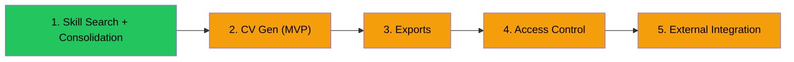

# StaffTrack — Feature Roadmap

A high-level assessment of proposed features based on Pre-Sales team feedback, evaluated against the current architecture.

---

## Current Architecture Snapshot

| Layer | Technology | Notes |
|:---|:---|:---|
| Frontend | Vanilla JS, HTML5, CSS3 | SPA-like, no build step |
| Backend | Node.js 20, Express | Single `backend` service |
| Database | SQLite (better-sqlite3) | Single file, WAL mode |
| Auth | In-memory token map | Email-only login, no passwords |
| Proxy | Nginx | Static files + reverse proxy |
| Orchestration | Docker Compose | Two services + proxy |

**Current roles**: Admin (hardcoded), HR, Coordinator, Staff *(expanding — see Role Model below)*

---

## Role Model (Expanded)

The application serves multiple personas beyond the original four. Two new roles are needed for Pre-Sales/tender workflows:

| Role | Persona | Primary Use Case |
|:---|:---|:---|
| **Admin** | IT / System Owner | Full system control, user management, data imports |
| **HR** | HR Team | View all staff data, run reports, export skill matrices |
| **Coordinator** | Project Manager | Create/manage projects, assign staff |
| **SA / Pre-Sales** | Solution Architect | Search skills, match staff to requirements, generate CVs for tenders |
| **Sales** | Sales / BD Team | Search skills, generate/export CVs for tender submissions |
| **Staff** | All employees | Self-service: update own skills, projects, CV profile |

### Permission Matrix

| Page / Action | Admin | HR | Coordinator | SA/Pre-Sales | Sales | Staff |
|:---|:---:|:---:|:---:|:---:|:---:|:---:|
| **My Submission** (own data) | ✅ | ✅ | ✅ | ✅ | ✅ | ✅ |
| **My CV Profile** (own) | ✅ | ✅ | ✅ | ✅ | ✅ | ✅ |
| **Skill Search / Filter** | ✅ | ✅ | ✅ | ✅ | ✅ | — |
| **View Staff Profiles** | ✅ | ✅ | ✅ | ✅ | ✅ | — |
| **Generate / View CV** (any staff) | ✅ | ✅ | — | ✅ | ✅ | Own only |
| **Export CV** (PDF/DOCX) | ✅ | ✅ | — | ✅ | ✅ | Own only |
| **Export Reports** (HR reports) | ✅ | ✅ | — | — | — | — |
| **Projects Management** | ✅ | — | ✅ | Read | Read | — |
| **Org Chart** | ✅ | ✅ | ✅ | ✅ | ✅ | ✅ |
| **Skill Consolidation** | ✅ | ✅ | — | — | — | — |
| **Catalog Management** | ✅ | — | — | — | — | — |
| **User/Role Management** | ✅ | — | — | — | — | — |
| **System / CSV Import** | ✅ | — | — | — | — | — |
| **External Sync Trigger** | ✅ | — | — | — | — | — |

> [!NOTE]
> SA/Pre-Sales and Sales have **identical access** — both are read-heavy consumers focused on skill search and CV generation for tenders.

---

## Feature Assessment

### 1. 📄 CV Generation

**What**: Auto-generate a white-labeled, professional CV from staff profiles — primarily for **tender/proposal submissions** by the company, with staff also able to reference their own CV.

**Complexity**: 🟠 Medium–High

#### ✅ Confirmed Decisions

| Decision | Answer |
|:---|:---|
| **Use case** | Company tender submissions (primary), staff personal reference (secondary) |
| **Branding** | White-labeled by default. Company logo/branding is optional (configurable) |
| **Data entry** | Self-service — staff fill in their own CV data. External-system data (staff catalog, projects) is pulled automatically |
| **Photo** | Yes — staff photo upload supported |
| **CV style** | Professional, clean — not a creative/designer CV |

#### CV Data Model — MVP vs. Future

| # | CV Section | MVP | Future | Source |
|:---:|:---|:---:|:---:|:---|
| 1 | **Professional Summary** | ✅ | | Free-text overview of expertise and career focus |
| 2 | **Contact Info + Photo** | ✅ | | Phone, LinkedIn, location, uploaded headshot |
| 3 | **Current Role & Dept** | ✅ | | Already in `submissions` (auto-filled from catalog) |
| 4 | **Technical Skills** | ✅ | | Already in `submission_skills` |
| 5 | **Project Experience** (active + historical) | ✅ | | Extend `submission_projects` with `start_date`, `description`, `is_active` |
| 6 | **Education & Qualifications** | ✅ | | New: institution, degree, field, years |
| 7 | **Professional Certifications** | ✅ | | New: cert name, issuer, dates, credential ID |
| 8 | **Work History** (prior employers) | ✅ | | New: employer, title, tenure, description |
| 9 | **Achievements & Awards** | | ✅ | Title, description, date, awarding body |
| 10 | **Training & Courses** | | ✅ | Course, provider, date, hours |
| 11 | **Languages** | | ✅ | Language + proficiency level |
| 12 | **Publications** | | ✅ | Title, venue, date, co-authors |
| 13 | **Soft Skills** | | ✅ | Leadership, communication, etc. |
| 14 | **References** | | ✅ | Name, title, contact (or "on request") |

#### Key Design Decisions

**Historical vs. Active Projects:**
- Extend `submission_projects` with `start_date`, `description`, `key_contributions`, `technologies_used`, and `is_active` flag
- Staff mark projects as completed and add retrospective details

**Data entry UX:**
- Dedicated **"My CV Profile"** page (separate from the current submission form)
- Tabbed sections for each CV category
- Staff control which sections appear on their generated CV

**White-label template system:**
- Clean, professional default template suitable for tender appendices
- Optional company branding slot (logo, company name, color accent)
- Future: multiple template styles (chronological, functional, skills-based)

#### MVP Tables

```
cv_profiles          → staff_email, summary, phone, linkedin, location, photo_path
education            → staff_email, institution, degree, field, start_year, end_year
certifications       → staff_email, name, issuer, date_obtained, expiry_date, credential_id
work_history         → staff_email, employer, job_title, start_date, end_date, description
cv_templates         → id, name, layout_html, company_logo_path, is_default
```

Plus schema changes to `submission_projects`: add `start_date`, `description`, `key_contributions`, `technologies_used`, `is_active`.

#### Delivery Phases

| Phase | Scope |
|:---|:---|
| **1a — Data Model + Profile Page** | New tables, "My CV Profile" page with tabbed sections, photo upload |
| **1b — CV Preview** | In-browser CV rendering from profile data, white-labeled template |
| **1c — Export** (ties into Feature 5) | PDF + DOCX download with optional company branding |

---

### 2. 🔐 Access Control Improvements

**What**: Improve authentication and authorization — better access control, proper session management. *(Entra ID SSO is a wishlist item for later.)*

**Complexity**: 🟡 Medium

**Current state**: Email-only login, in-memory tokens (`Map()`), no passwords, no expiry, sessions lost on restart. Four roles (admin/HR/coordinator/staff) but coarse-grained.

#### ✅ Confirmed Decisions

| Decision | Answer |
|:---|:---|
| **Authentication** | Authenticate against existing auth service (`https://appcore.beesuite.app`) |
| **Auth Payload** | JSON body with `email` and Base64-encoded `password` |
| **Entra ID SSO** | Wishlist — not a priority right now |
| **Focus area** | Improve access control mechanisms over the current system |

#### Improvement Areas

| Area | Current | Improvement |
|:---|:---|:---|
| **Session persistence** | In-memory `Map()` — lost on restart | JWT tokens with expiry + env-based secret |
| **Password auth** | None — email-only login | Authenticate via API call to `https://appcore.beesuite.app` (no local password storage) |
| **Granular permissions** | 4 coarse roles | 6 roles with page-level + action-level flags (see Role Model above) |
| **New roles** | N/A | Add SA/Pre-Sales and Sales roles |
| **Token refresh** | None | Add `/auth/refresh` endpoint with refresh tokens |
| **Audit trail** | None | Log login events, permission changes |
| **Entra ID SSO** | N/A | 🔮 Future wishlist |

---

### 3. 🔗 External System Integration (Project Data / Staff Data)

**What**: Pull staff and project data from in-house live systems instead of CSV imports.

**Complexity**: 🟡 Medium (known systems, known APIs)

**Current state**: CSV imports via System Management page into `staff` and `projects_catalog` tables.

#### ✅ Confirmed Decisions

| Decision | Answer |
|:---|:---|
| **Source systems** | Two in-house systems (not generic/customer-specific) |
| **System A** | Connects via **DreamFactory** (REST-over-database) |
| **System B** | Direct **REST API** |

#### Approach

| System | Integration Strategy |
|:---|:---|
| **DreamFactory system** | Call DreamFactory's auto-generated REST endpoints to query staff/project tables. DreamFactory handles DB auth + pagination. |
| **REST API system** | Direct HTTP calls to existing API endpoints with appropriate auth (API key or token). |

#### Implementation Outline

- Backend connector module with adapter pattern: `connectors/dreamfactory.js`, `connectors/restapi.js`
- Configurable via environment variables (URLs, API keys, sync schedule)
- Sync modes: scheduled cron sync (primary) + manual trigger from System Management page
- Upsert into existing `staff` and `projects_catalog` tables
- Sync log for audit trail and error tracking

> [!NOTE]
> Since both sources are in-house and known, this is more tractable than a generic connector framework. We can build specific adapters and generalize later if needed.

---

### 4. 🔌 Retrofit into Existing System — ⏸️ ON HOLD

**Status**: Parked — will revisit when more context is available on target system requirements.

---

### 5. 📥 Export to PDF / DOCX

**What**: Export CVs and operational reports to PDF, DOCX, and Excel formats.

**Complexity**: 🟡 Medium

#### ✅ Confirmed Decisions

| Decision | Answer |
|:---|:---|
| **Scope** | Not just CVs — HR and management reports are essential too |

**Approach**:

| Format | Library Options |
|:---|:---|
| **PDF** | Puppeteer (headless Chrome), `pdfkit`, `html-pdf`, or client-side `jspdf` |
| **DOCX** | `docx` (npm) — programmatic Word document generation |
| **Excel** | `exceljs` or `xlsx` (npm) — for tabular data exports |

#### Export Targets

| Export | Format | Audience | Priority |
|:---|:---|:---|:---|
| **Staff CV** | PDF, DOCX | Tender team / Staff | MVP |
| **Staff report** (all submissions) | PDF, Excel | HR / Management | MVP |
| **Skills matrix** | Excel, CSV | HR | MVP |
| **Project staffing report** | PDF, DOCX | Management / Tender team | Post-MVP |
| **Individual submission summary** | PDF | Staff | Post-MVP |

---

### 6. 🔍 Search / Order by Skill Level — ✅ COMPLETED

**What**: Filter and sort staff by skills and proficiency ratings.
**Status**: Implemented and verified.

---

### 7. 🏢 Org Chart for Department / Team — ⏸️ ON HOLD

**Status**: On hold until more data points are available. Current ApexTree implementation with hybrid layout is functional — enhancements deferred.

---

### 8. 🧩 Skill Consolidation (Data Governance) — ✅ COMPLETED

**What**: Admin/HR tool to clean up free-form skill entries — merge duplicates, rename, split compound skills, and maintain a canonical skill catalog.
**Status**: Implemented and verified.

---

## Confirmed Prioritization

| Priority | Feature | Effort | Status |
|:---:|:---|:---:|:---|
| **1** | 🔍 Skill Search/Sort + 🧩 Skill Consolidation | 🟢 Low | ✅ Completed |
| **2** | 📄 CV Generation (MVP) | 🟢 Low | ✅ Completed (Profile Page + Preview + PDF Export) |
| **3** | 📉 Gantt Chart Performance | 🟢 Low | ✅ Completed (Canvas Virtualization + Optimization) |
| **4** | 🔐 Access Control | 🟢 Low | ✅ Completed (JWT, refresh tokens, audit log, 6 roles) |
| **5** | 📥 Exports (CV + Reports) | 🟡 Medium | Tied to CV Gen phase 1c, plus HR/mgmt reports |
| **6** | 🔗 External Integration | 🟡 Medium | DreamFactory + REST API adapters |
| — | 🏢 Org Chart Enhancement | — | ⏸️ On hold |
| — | 🔌 Retrofit | — | ⏸️ On hold |



## Architecture Considerations

> [!NOTE]
> Plan for migrating from **SQLite → PostgreSQL** early. SQLite works well for the prototype, but concurrent external syncs and multi-user enterprise deployments will require a robust database. **Important:** The production environment already has data, so a robust data migration strategy (exporting current SQLite data and importing to PostgreSQL) must be included.

---

# Long-Term Vision

The following items represent the dynamic roadmap for future expansion once the prioritized tender-enablement features are complete.

## 🟢 Phase 1: Foundational Enhancements (Post-MVP)

### UI/UX Refinement
- **Micro-animations**: Implement smooth transitions for tab switching and list loading.
- **Glassmorphism Theme**: Enhance the premium dark theme with better contrast and subtle transparency effects.
- **Interactive Org Chart**: Expand ApexTree integration to allow node expansion/collapsing and direct staff view navigation.

### Data Management
- **Pagination**: Implement server-side pagination for `staff-view` and `skills` pages to handle >1000 records.
- **Global Search**: A unified header search bar to quickly find staff, projects, or skills from any page.
- **Improved Validation**: Client-side and server-side validation for complex CSV imports.

## 🟡 Phase 2: Advanced Analytics & AI

### Reporting & Visualization
- **ApexCharts Integration**: Visual dashboards for skill distribution across departments.
- **Project Heatmaps**: Identify over/under-utilized staff resources.
- **Export Overhaul**: Enhanced PDF/Excel reports with custom branding.

### AI Integration
- **Skill Recommendation**: Suggest skills to staff based on their project history.
- **CV Parsing**: Automatically extract skills and projects from uploaded PDF resumes.
- **Smart Matching**: Suggest staff for projects based on required skill gap analysis.

## 🔴 Phase 3: Scaling & Mobility

### Multi-Tenancy Expansion
- **Tenant Management UI**: Self-service onboarding for new departments or company branches.
- **Subscription Engine**: Integration for tiered access if commercializing the platform.

### Mobile Experience
- **Progressive Web App (PWA)**: Support for offline skill updates and mobile-first navigation.
- **Push Notifications**: Notify staff when project assignments change or quarterly skill updates are due.

---
*Note: This roadmap is dynamic and subject to change based on stakeholder feedback.*
